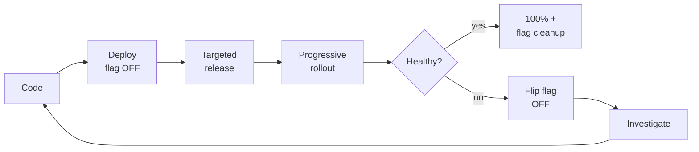

# Observability and <span class="text-accent">Feature Flagging</span>

Why observability companies invest in feature flagging — and how you can benefit.

<div class="pt-8">
  <OpenFeatureLogo size="180px" />
</div>

<div class="pt-12">
  <PresenterProfile name="Alexandra Oberaigner" company="Dynatrace" size="72px" />
</div>

---
layout: intro
---

# Welcome

Two big 2025–2026 acquisitions tell <span class="text-accent">different halves</span> of the same convergence story.

**Dynatrace bought DevCycle.** **Datadog bought Eppo.**<br/>
Both lean on <span class="text-green">OpenFeature</span>; neither press release mentions <span class="text-green">OpenTelemetry</span>.

This talk fills that gap.

---

# Agenda

<div class="grid grid-cols-[auto_1fr] gap-x-4 gap-y-3 mt-8">

<div class="text-accent font-bold">01</div>
<div>Current happenings — two big acquisitions</div>

<div class="text-accent font-bold">02</div>
<div>What is feature flagging?</div>

<div class="text-accent font-bold">03</div>
<div>Why are observability companies investing in feature flagging?</div>

<div class="text-accent font-bold">04</div>
<div>Live: three demo scenarios on the OpenTelemetry demo</div>

<div class="text-accent font-bold">05</div>
<div>Why <span class="text-green">OpenFeature</span> + <span class="text-green">OpenTelemetry</span> are more than the sum of their parts</div>

</div>

---
layout: section
---

# 01 · Current happenings

Two acquisitions, one convergence

---
layout: two-cols
---

# Dynatrace acquires <span class="text-accent">DevCycle</span>

- Release safety, progressive delivery, kill switches
- *"Releases have become harder to understand and riskier to manage"*
- **OpenFeature called out** — Dynatrace helped establish it in 2022
- Forward-looking: *"health-driven feature control"*

::right::

# Datadog acquires <span class="text-accent">Eppo</span>

- Experimentation, measurement, product analytics
- AI as centrepiece: *"compare multiple models side-by-side, determine engagement against cost tradeoffs"*
- **OpenFeature not mentioned**
- Statsig (Vijaye Raji): *"experimentation is central to the modern dev stack"*

---

# What both press releases <span class="text-accent">do not</span> mention

<div class="mt-12 text-2xl text-center">

OpenTelemetry. Semantic conventions.<br/>
**How flag evaluations actually correlate to telemetry.**

</div>

<div class="mt-12 text-center text-muted">
  That correlation is the whole point — and it's what makes this story <span class="text-green">vendor-neutral</span>.
</div>

---
layout: section
---

# 02 · What is feature flagging?

---

# Feature flagging in one slide

A <span class="text-accent">runtime switch</span> that decouples *deploy* from *release*.

<div class="grid grid-cols-2 gap-8 mt-6">

<div>

### <span class="text-green">What it gives you</span>

- Ship dark, release later
- Progressive rollout (1% → 5% → 100%)
- Kill switches for incidents
- A/B testing & experimentation
- Targeted access (beta cohorts, regions, tiers)

</div>

<div>

### <span class="text-accent">Where the pain starts</span>

- Flags multiply, become permanent
- *"Did the new variant cause the latency spike?"*
- *"Is this rollout actually moving the KPI?"*
- Telemetry doesn't know flags exist
- → **this is where observability comes in**

</div>

</div>

---

# The SDLC with feature flags



Every arrow after **Deploy** is a flag operation — and every one of them is invisible to your dashboards by default.

---
layout: section
---

# 03 · Why observability companies are investing

The feature-flag lifecycle is best understood with OpenTelemetry.

---

# Three jobs observability needs flags for

<div class="grid grid-cols-3 gap-4 mt-8">
  <div class="card">
    <h3>💰 Business impact</h3>
    <p>Did this variant make money?<br/>→ <strong>Tracking API</strong></p>
    <p class="text-muted text-xs mt-2">Datadog / Eppo angle</p>
  </div>
  <div class="card">
    <h3>🔎 Troubleshooting</h3>
    <p>Which cohort is slow / erroring?<br/>→ <strong>SemConv on spans</strong></p>
    <p class="text-muted text-xs mt-2">Both angles</p>
  </div>
  <div class="card">
    <h3>🛟 Releasing safely</h3>
    <p>Canary, kill switch, rollback<br/>→ <strong>Targeting + telemetry</strong></p>
    <p class="text-muted text-xs mt-2">Dynatrace / DevCycle angle</p>
  </div>
</div>

<div class="mt-10">

Each one only works if flag evaluations are <span class="text-accent">correlated with telemetry</span> — which only works because of a small, standardised set of attributes.

</div>

---

# OpenTelemetry <span class="text-accent">feature-flag</span> semantic conventions

A tiny set of standardised attributes — that's it.

```yaml
feature_flag.key:           recommendationAlgorithm
feature_flag.variant:       personalized
feature_flag.provider_name: flagd
```

Plus span event names and metric counters for evaluations and errors.

<div class="mt-8">

These attributes are what let traces, metrics and logs <span class="text-green">pivot on flag key or variant</span> — without bespoke per-vendor integration.

</div>

---

# <span class="text-handwritten text-green">OpenFeature concepts</span> we'll touch on stage

| Concept | One-liner |
|---|---|
| **Evaluation API** | The user-facing interface application code uses to evaluate flags |
| **Provider** | Translation layer between the SDK and a flag-management system |
| **Evaluation context** | Container for arbitrary data driving dynamic evaluation (user, tier, region) |
| **Hooks** | Middleware-like callbacks (`before` / `after` / `error` / `finally`) — the observability extension point |
| **Tracking API** | Associates flag evaluations with later business actions — enables experimentation analysis |

---

# How SemConv ends up on every span — <span class="text-accent">for free</span>

Register the OpenTelemetry hook once at startup:

```python
# Python (recommendation, llm)
from openfeature.contrib.hook.opentelemetry import TracingHook
api.add_hooks([TracingHook()])
```

```go
// Go (product-catalog)
openfeature.AddHooks(otelhooks.NewTracesHook())
```

After that, **every** flag evaluation in those services automatically attaches `feature_flag.*` attributes to the active span.

<div class="mt-4 text-muted text-sm">
  This is the "OpenFeature contributed SemConv to OpenTelemetry" point — made concrete.
</div>

---
layout: section
---

# 04 · Live demo

Three scenarios on the OpenTelemetry community demo

---

# Demo setup

The astronomy shop — <span class="text-accent">OpenTelemetry community demo</span>:<br/>
<https://github.com/open-telemetry/opentelemetry-demo>

<div class="mt-6">

- Already uses **OpenFeature** with the **flagd** provider
- Ships the **OpenTelemetry TracingHook** in Go and Python services
- → SemConv attributes flow onto spans <span class="text-green">for free</span> in those services
- Talk branch: `feat/openfeature-talk-demo` on the fork

</div>

---
layout: two-cols
---

# Demo 1 · Recommendation A/B

**Datadog / Eppo pillar** — *"is the new model actually making money?"*

**Flag:** `recommendationAlgorithm`<br/>
**Variants:** `popularity` · `collaborative` · `personalized`<br/>
**Service:** `recommendation` (Python)

OpenFeature concepts:
- Evaluation context: `userId`, `userTier`, `region`
- Targeting: `personalized` for `userTier=premium`
- **Tracking API**: `add_to_cart`, `checkout_completed`

::right::

# <span class="text-handwritten text-green">On stage</span>

OTel signals:
- Spans on `recommendation.ListRecommendations` carry `feature_flag.key` / `feature_flag.variant`
- Counters split by variant: impressions, CTR, conversion

Grafana panel split by variant — conversion rate, AOV, p95 latency.<br/>
**Personalized lifts conversion +X% but adds latency.**

---
layout: two-cols
---

# Demo 2 · Product-catalog canary

**Dynatrace / DevCycle pillar** — *releasing safely*

**Flag:** `productCatalogCanary`<br/>
**Variants:** `v1` · `v2` (fractional 5/25/50/100%)<br/>
**Service:** `product-catalog` (Go)

OpenFeature concepts:
- Provider: flagd, server-side resolution
- Hooks: Go OTel `TracesHook` attaches `feature_flag.*` per SemConv
- Targeting rules edited live in flagd-ui

::right::

# <span class="text-handwritten text-green">On stage</span>

OTel signals:
- Filter spans by `feature_flag.variant=v2`
- Error / latency spike isolated to the canary cohort
- Flip back to `5%` → metrics recover live

> *"No code change, no redeploy — the flag key is already on every span. That's the <span class="text-accent">SemConv payoff</span>."*

---
layout: two-cols
---

# Demo 3 · Multi-model AI summary

**Shared AI theme** — covers both pillars

**Flag:** `productSummaryModel`<br/>
**Variants:** `off` · `model-a` · `model-b`<br/>
**Service:** `llm` (Python — adds the missing `TracingHook`)

OpenFeature concepts:
- Hooks: add `TracingHook` → SemConv on LLM spans
- Evaluation context: `userTier=beta`
- Tracking API: `summary_helpful_clicked`

::right::

# <span class="text-handwritten text-green">On stage closing beat</span>

OTel signals per variant:
- **token cost**, **latency**, **error rate**
- Spans carry `feature_flag.key` / `feature_flag.variant`

Flip `productSummaryModel=model-b` plus the existing `llmRateLimitError` → model-B degrades, errors visible **per variant**.

Flip back → <span class="text-green">incident contained, no redeploy</span>.

---
layout: section
---

# 05 · More than the sum of their parts

OpenFeature + OpenTelemetry — the vendor-neutral path

---

# The <span class="text-accent">unique angle</span>

|  | Dynatrace / DevCycle | Datadog / Eppo |
|---|---|---|
| **Centre of gravity** | Release safety, progressive delivery | Experimentation, product analytics |
| **Headline use case** | Risk reduction, incident response | Compare AI models, engagement vs cost |
| **Mentions OpenFeature?** | ✅ Yes — helped establish it in 2022 | ❌ No |
| **Mentions OpenTelemetry / SemConv?** | ❌ No | ❌ No |

<div class="mt-8">

> Dynatrace bought the release-safety half. Datadog bought the experimentation half.<br/>
> Both lean on <span class="text-green">OpenFeature</span>; neither mentions <span class="text-green">OpenTelemetry</span>.<br/>
> The **OpenFeature + OTel SemConv** combination is the only <span class="text-accent">vendor-neutral</span> path through this convergence.

</div>

---

# Takeaways

<div class="grid grid-cols-[auto_1fr] gap-x-4 gap-y-5 mt-8">

<div class="text-accent font-bold text-2xl">1</div>
<div>Flag evaluations are first-class telemetry — once you register one hook.</div>

<div class="text-accent font-bold text-2xl">2</div>
<div>SemConv is the standardisation layer Dynatrace and Datadog implicitly need but don't advertise.</div>

<div class="text-accent font-bold text-2xl">3</div>
<div><span class="text-green">OpenFeature</span> + <span class="text-green">OpenTelemetry</span> is the vendor-neutral version of the same convergence story.</div>

<div class="text-accent font-bold text-2xl">4</div>
<div>You can adopt it today: <code>add_hooks([TracingHook()])</code> on a service you already run.</div>

</div>

---

# Getting started

<div class="grid grid-cols-3 gap-4 mt-6">
  <div class="card text-center">
    <h3>Learn</h3>
    <p>Visit <a href="https://openfeature.dev">openfeature.dev</a> and the OTel SemConv docs</p>
  </div>
  <div class="card text-center">
    <h3>Try</h3>
    <p>Run the <a href="https://github.com/open-telemetry/opentelemetry-demo">OTel community demo</a> — flags already wired</p>
  </div>
  <div class="card text-center">
    <h3>Connect</h3>
    <p>Chat with us on <a href="https://cloud-native.slack.com/archives/C0344AANLA1">#openfeature</a> in CNCF Slack</p>
  </div>
</div>

<div class="mt-10 text-center">
  <QRCode url="https://github.com/alexandraoberaigner/talk-observability-and-feature-flagging" size="160px" />
</div>

---
layout: end
---

# Thank You

Questions?

<div class="mt-8">
  <OpenFeatureLogo size="200px" />
</div>
