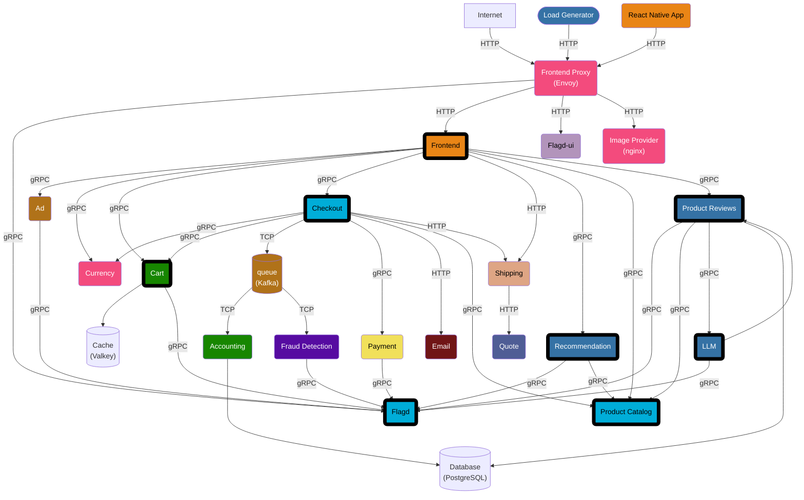

# Why Are Observability Companies <br/>Investing in <span class="text-accent">Feature Flagging</span>?

What OpenFeature and OpenTelemetry give you, on any stack you already run.

<div class="pt-8">
  <OpenFeatureLogo size="180px" />
</div>

<div class="pt-12 flex justify-center gap-12">
  <PresenterProfile name="Alexandra Oberaigner" company="Dynatrace" size="72px" photo="/alexandra-oberaigner.jpg" />
  <PresenterProfile name="Lukas Reining" company="codecentric" size="72px" photo="/lukas-reining.jpg" />
</div>

<!--
It's great to see so many people interested in ...title

We not only aim to answer this question today from the company's strategic motivation but also we want to equip you with open-source tooling that can help you xxxx observable feature flagging. 
The talk is about what the open-source layer underneath gives you regardless of the company.

Both maintainers of OpenFeature.
-->

---
layout: section
---

# Two Acquisitions <br /> in Nine Months.

<!--
We open here because it is the clearest external signal that observability and feature flagging are converging. This talk is not about the acquisitions and not about either company. Everything after this slide is about the open-source layer that any practitioner can use, regardless of which observability backend they happen to run.
-->

---

<div class="grid grid-cols-2 grid-rows-2 gap-x-4 gap-y-0 mt-4">

<div class="col-start-1 row-start-1">
<div class="border border-gray-600 rounded-lg overflow-hidden text-sm shadow-lg">
    <div class="bg-gray-800 px-3 py-1 text-xs text-gray-400 flex items-center gap-2">
      <span class="w-2 h-2 rounded-full bg-red-500 inline-block"></span>
      <span class="w-2 h-2 rounded-full bg-yellow-500 inline-block"></span>
      <span class="w-2 h-2 rounded-full bg-green-500 inline-block"></span>
      <span class="ml-2 truncate">datadoghq.com/about/latest-news</span>
    </div>
    <div class="p-4 bg-gray-900">
      <div class="text-xs text-gray-500 mb-2">DATADOG · MAY 2025</div>
      <div class="font-bold text-white leading-snug mb-2">Datadog acquires Eppo to expand AI, product analytics, experimentation and feature flag capabilities</div>
      <div class="text-gray-400 text-xs leading-relaxed">"Compare multiple models side-by-side. Determine user engagement against cost tradeoffs."</div>
    </div>
  </div>
  <div class="text-xs text-muted mt-2 wrap">https://www.datadoghq.com/about/latest-news/press-releases/datadog-acquires-eppo-to-expand-its-ai/</div>
 
</div>

<div class="col-start-2 row-start-2">
   <div class="border border-gray-600 rounded-lg overflow-hidden text-sm shadow-lg">
    <div class="bg-gray-800 px-3 py-1 text-xs text-gray-400 flex items-center gap-2">
      <span class="w-2 h-2 rounded-full bg-red-500 inline-block"></span>
      <span class="w-2 h-2 rounded-full bg-yellow-500 inline-block"></span>
      <span class="w-2 h-2 rounded-full bg-green-500 inline-block"></span>
      <span class="ml-2 truncate">dynatrace.com/news</span>
    </div>
    <div class="p-4 bg-gray-900">
      <div class="text-xs text-gray-500 mb-2">DYNATRACE · JANUARY 2026</div>
      <div class="font-bold text-white leading-snug mb-2">Dynatrace acquires DevCycle to strengthen feature delivery</div>
      <div class="text-gray-400 text-xs leading-relaxed">"This acquisition further advances observability into an active system of control."</div>
    </div>
  </div>
  <div class="text-xs text-muted mt-2 truncate">dynatrace.com/news/blog/dynatrace-acquires-devcycle</div>
</div>

</div>

<!--
* Datadog bought Eppo in May 2025. 
* Dynatrace bought DevCycle in January 2026. 
* Two of the biggest observability vendors made significant investments in feature flagging. 
* While DDog focuses on the experimentation use case of feature flagging, DT focuses on release safely & progressive delivery

Why?
-->

---
layout: intro
---

# Why Now?

<!--
This is the talk's question. The audience leaves with an answer that is not vendor-shaped.
-->

---

# Agenda

<div class="grid grid-cols-[auto_1fr] gap-x-4 gap-y-3 mt-8">

<div class="text-accent font-bold">01</div>
<div>What is feature flagging</div>

<div class="text-accent font-bold">02</div>
<div>OpenFeature and OpenTelemetry</div>

<div class="text-accent font-bold">03</div>
<div>Use case demos on the OpenTelemetry demo</div>

<div class="text-accent font-bold">04</div>
<div>What the open standards give you, on any stack you already run</div>

<div class="text-accent font-bold">05</div>
<div>Q&A</div>

</div>

<!--
To answer this question: we are starting with the basics. Talking about feature flagging & the 2 open-source projects which are building the foundation. OF & Otel. We are working our way toward the answer with our 3 live demos.

And finally summarize the answer
-->

---
layout: section
---

# 01 · Feature Flagging

A runtime switch.

<!--
What is feature flagging?

Audience: 
* Who has feature flagged before?
*
-->

---

# What a Feature Flag Does

<div class="text-2xl mt-8">

It decouples <span class="text-accent">deploy</span> from <span class="text-accent">release</span>.

</div>

<div class="mt-4 text-muted">

Ship code to production. Decide later who sees it.

</div>

<!--
That single sentence is the whole concept. Deploy is a build-and-restart event. Release is a config change. Once you separate them, everything else falls out: progressive rollout, kill switches, A/B tests, beta cohorts.
-->

---

<div class="flex justify-center mt-8">
  
</div>

<!--
This is our definition.

That single sentence is the whole concept. Deploy is a build-and-restart event. Release is a config change. Once you separate them, everything else falls out: progressive rollout, kill switches, A/B tests, beta cohorts.
-->

---

# Not All Flags Are the Same

<div class="flex justify-center mt-2">
  
</div>

<div class="text-xs text-muted mt-3 text-center">martinfowler.com/articles/feature-toggles.html</div>

<!--
This taxonomy is from Pete Hodgson's article on martinfowler.com. The categories matter because they have very different lifetimes and very different decision points. A release toggle is short-lived and mostly static. An experiment toggle is dynamic, per-request, and lives long enough to gather data. An ops toggle is a circuit breaker. Permissioning toggles are long-lived by design.

The three demos cover the three most observability-relevant categories: release, ops, experiment. Watch which category each demo lives in.
-->

---

# Feature flag lifecycle

<style scoped>
  .lc {
    display: grid;
    grid-template-columns: max-content 2rem max-content max-content max-content;
    column-gap: 0.4rem;
    row-gap: 0.35rem;
    align-items: center;
    justify-content: center;
    margin: 1rem auto 0;
  }
  .stage {
    padding: 0.45rem 1rem;
    border-radius: 0.5rem;
    border: 2px solid var(--of-accent-purple);
    background: var(--of-bg-soft);
    font-weight: 600;
    text-align: center;
    min-width: 10rem;
  }
  .stage.loop {
    border-style: dashed;
    background: rgba(124, 58, 237, 0.06);
  }
  .arr-d {
    text-align: center;
    color: var(--of-text-muted);
    font-size: 1rem;
    line-height: 1;
  }
  .darr {
    color: var(--of-text-muted);
    font-size: 0.95rem;
    letter-spacing: 0.1em;
    white-space: nowrap;
  }
  .obs {
    position: relative;
  }
  .obs::before {
    content: '←';
    position: absolute;
    left: -1.5rem;
    top: 50%;
    transform: translateY(-50%);
    color: var(--of-accent-purple);
    font-size: 1.4rem;
    font-weight: bold;
  }
  /* L-bracket connecting Observation (bottom-right) up to Activate (top-right) */
  .loop-arrow {
    position: relative;
    align-self: stretch;
    margin: 1.5rem 0 2.15rem;
    border-top: 2px dashed var(--of-accent-purple);
    border-left: 2px dashed var(--of-accent-purple);
    border-bottom: 2px dashed var(--of-accent-purple);
    border-radius: 0.5rem 0 0 0.5rem;
  }
  .loop-arrow::after {
    /* arrowhead at top-right pointing right into Activate */
    content: '';
    position: absolute;
    top: -6px;
    right: -1px;
    width: 0;
    height: 0;
    border-top: 5px solid transparent;
    border-bottom: 5px solid transparent;
    border-left: 8px solid var(--of-accent-purple);
  }
  .loop-arrow::before {
    /* small connector dot at bottom-right showing entry point from Observation */
    content: '';
    position: absolute;
    bottom: -4px;
    right: -4px;
    width: 8px;
    height: 8px;
    border-radius: 50%;
    background: var(--of-accent-purple);
  }
  /* Sticky notes */
  .note {
    padding: 0.55rem 0.85rem;
    background: #fef3a0;
    color: #4a3a00;
    font-family: 'Architects Daughter', 'Caveat', 'Patrick Hand', 'Comic Sans MS', cursive;
    font-size: 1.15rem;
    line-height: 1.15;
    box-shadow: 2px 4px 8px rgba(0, 0, 0, 0.28);
    max-width: 14rem;
    border-radius: 2px;
  }
  .note-1 { transform: rotate(-1.6deg); background: #fef3a0; }
  .note-2 { transform: rotate(1.3deg);  background: #fde68a; }
</style>

<div class="lc">

  <div class="stage" style="grid-column: 3; grid-row: 1;">📝 Create</div>
  <div class="arr-d" style="grid-column: 3; grid-row: 2;">↓</div>
  <div class="stage" style="grid-column: 3; grid-row: 3;">⚫️ Deploy</div>
  <div class="arr-d" style="grid-column: 3; grid-row: 4;">↓</div>
  <div class="stage" style="grid-column: 3; grid-row: 5;">⚪️ Activate</div>
  <div class="arr-d" style="grid-column: 3; grid-row: 6;">↓</div>
  <div class="stage obs" style="grid-column: 3; grid-row: 7;">⚙️ Observation</div>
  <div class="arr-d" style="grid-column: 3; grid-row: 8;">↓</div>
  <div class="stage" style="grid-column: 3; grid-row: 9;">🧹 Clean-up</div>
  <div class="arr-d" style="grid-column: 3; grid-row: 10;">↓</div>
  <div class="stage" style="grid-column: 3; grid-row: 11;">🗄️ Archive</div>

  <div class="darr" style="grid-column: 4; grid-row: 7;">┈┈┈▸</div>
  <div class="note note-1" style="grid-column: 5; grid-row: 7;">Which flag caused<br/>this regression?</div>

  <div class="darr" style="grid-column: 4; grid-row: 9;">┈┈┈▸</div>
  <div class="note note-2" style="grid-column: 5; grid-row: 9;">Safe to remove<br/>from code?</div>

  <div class="stage loop" style="grid-column: 1; grid-row: 5 / span 3; align-self: center;">🔄 Deactivate<br/>&amp; Fix</div>
  <div class="loop-arrow" style="grid-column: 2; grid-row: 5 / span 3;"></div>

</div>

<div class="text-sm text-muted text-center mt-4">

The cycle is idealized. Reality is messier.

</div>

<!--
explain steps.

lifeycle is idealized, reality often different, flags dont get deleted, code doesnt get cleaned up, observation is hard

Issues along the way:
* Observation step: did a new feature cause the observed error rate increase? Which feature flag? When was it toggled?
* Clean-up: is the feature rolled out completely - can we remove the feature flag & the old code
-->

---
layout: section
---

# 02 · Open Standards

OpenFeature and OpenTelemetry.

<!--
Briefly. Just enough to make the demo and the synthesis land.
-->

---

# OpenFeature

The vendor-neutral standard for flag evaluation. A CNCF incubating project.

<div class="flex justify-center mt-4">
  
</div>

<div class="text-xs text-muted mt-4 text-center">openfeature.dev/docs/reference/intro</div>

<!--
The architecture in one diagram. Application code talks to the Evaluation API. Hooks run around every evaluation. The provider translates to a specific flag management system: flagd, DevCycle, LaunchDarkly, Statsig, anything that implements the contract. Swap providers without touching application code.

Five concepts to know: Evaluation API, Provider, Evaluation Context, Hooks, Tracking API. The hook is the one to remember. It is how a global decision, "send flag data with my traces," turns into zero per-evaluation code.
-->

---

# OpenFeature in Code

```java {1-3|5-6|8-11|13-14|all}
// 1. Configure provider and OTel hook
OpenFeatureAPI api = OpenFeatureAPI.getInstance();
api.setProviderAndWait(new MyFeatureProvider());

// 2. Create a client
Client client = api.getClient();

// 3. Evaluation context for targeting
Map<String, Value> attrs = new HashMap<>();
attrs.put("tier", new Value("premium"));
EvaluationContext ctx = new ImmutableContext("user-42", attrs);

// 4. Evaluate
boolean enabled = client.getBooleanValue("v2_enabled", false, ctx);
```

<div class="text-xs text-muted mt-3">openfeature.dev/docs/reference/sdks/server/java</div>

<!--
Four steps. Register a provider, add the OTel hook, create a client, evaluate a flag. The provider is the only vendor-specific line. Swap MyFeatureProvider for flagd, DevCycle, LaunchDarkly, or anything that implements FeatureProvider. The TracesHook emits a feature_flag.evaluation span event on the active OTel span for every evaluation. The evaluation context carries the targeting key and attributes the provider uses for targeting rules. The flag evaluation itself returns a string variant. All of this is vendor-neutral. The only thing that changes between vendors is the provider constructor.
-->

---

# OpenTelemetry

The vendor-neutral standard for telemetry: traces, metrics, logs.

<div class="mt-12 text-xl">

What matters for this talk: the <span class="text-accent">`feature_flag.evaluation`</span> event.

</div>

<div class="mt-6 text-muted">

Defined together by the OpenFeature and OpenTelemetry communities.

</div>

---

# `feature_flag.evaluation` Attributes

| Attribute | Requirement | Example |
|---|---|---|
| `feature_flag.key` | **Required** | `recommendationAlgorithm` |
| `feature_flag.result.variant` | **Cond. Required** | `personalized` |
| `feature_flag.provider.name` | Recommended | `flagd` |
| `feature_flag.result.reason` | Recommended | `targeting_match`, `split` |
| `feature_flag.context.id` | Recommended | `5157782b-...` |
| `error.type` | Cond. Required | `flag_not_found` |

<div class="text-xs text-muted mt-4">

opentelemetry.io/docs/specs/semconv/feature-flags/feature-flags-events · openfeature.dev/specification/appendix-d

</div>

<!--
Walk through the table top to bottom. The key is always required. Variant is required when the provider returns one, otherwise the raw value is required. Reason codes map directly to OpenFeature resolution reasons, lowercased to snake_case: targeting_match means a rule matched, split means random assignment, default means no dynamic evaluation happened. The context ID is typically the targeting key. The set ID and version help correlate evaluations to specific flag configurations. Error type and message are only present when something went wrong.

The OpenFeature hook implementations follow the mapping defined in Appendix D of the OpenFeature spec. That is why a single hook setup gives you all of these attributes automatically.
-->

---

# How it Works Together

```python
# Python
from openfeature.contrib.hook.opentelemetry import TracingHook
api.add_hooks([TracingHook()])
```

```go
// Go
openfeature.AddHooks(otelhooks.NewTracesHook())
```

<div class="mt-8">

After this runs at startup, <span class="text-accent">every flag evaluation</span> emits a `feature_flag.evaluation` span event on the active span.

</div>

<div class="mt-4 text-muted">

No per-call code. No bespoke instrumentation per flag. One line at startup.

</div>

<!--
This is the single most important slide in the deck. Three lines of code. The hook intercepts every flag evaluation and emits a feature_flag.evaluation span event on the currently active span. SemConv defines the attribute names on that event. Everything you are about to see on stage is downstream of these three lines.
-->

---
layout: section
---

# 03 · Live Demo

Three scenarios. One hook.

<!--
We switch screens here. Three demos, run in this order: canary, AI, recommendation. The infrastructure does not change between them. Only the flags change.
-->

---

# The Astronomy Shop

The <span class="text-accent">OpenTelemetry community demo</span>. A small e-commerce stack instrumented end-to-end with OpenTelemetry.

<div class="mt-6">

- Already uses OpenFeature with the flagd provider
- Already ships `TracingHook` in Go and Python services
- Flag evaluation events flow onto spans automatically

</div>

<div class="mt-8 text-xs text-muted">
github.com/open-telemetry/opentelemetry-demo · talk fork: github.com/alexandraoberaigner/opentelemetry-demo
</div>

<!--
The talk runs on a fork of the OpenTelemetry community demo, with three demo-specific flags added. Everything else is upstream.
-->

---
layout: default
---

<div class="flex justify-center items-center h-full">
  
</div>

<!--
What the audience actually sees. The astronomy shop is just a webshop. Nothing special on the surface. The interesting part is what's underneath, which is the next slide.
-->

---
layout: default
---

# Inside the Astronomy Shop


<div class="flex justify-center items-center">



</div>

<!--
All services instrumented with OpenTelemetry. Feature flags via flagd.
-->

---
layout: two-cols
---

# Demo 1 of 3 <br/> <span class="text-accent">Canary rollout</span>

`productCatalogCanary` + `productCatalogV2Severity`<br/>
Service: `product-catalog` (Go)

<div class="mt-4 text-sm text-muted">
Flag category: <span class="text-green">release toggle</span>. Short-lived, percentage-based.
</div>

::right::

# <span class="text-handwritten text-green">On stage</span>

- Baseline. 5% v2, no errors
- Step rollout. Yellow latency rises
- Add severity. Red errors appear
- Jaeger: `feature_flag.key=productCatalogCanary feature_flag.result.variant=v2`
- Roll back. Panels recover in ~30s

<div class="mt-6 text-muted">

Rollback: one flag flip. No deploy. No restart.

</div>

<!--
Stage slot 1. About 3 minutes on the screen. Two flags compose: one controls who gets v2, the other controls how broken v2 is. The dashboard reads app.catalog.version so the severity flag does not contaminate the rollout cohort.

Run before this demo: make demo1   (stop after: make loadgen-stop)
This starts k6 demo1 load automatically and walks through flag escalation step by step.
Press Enter to advance each step — the script handles all flag changes.

  step 0  baseline     0% v2, severity=none
  step 1  canary       5% v2, severity=none
  step 2  escalate    25% v2, severity=low  (15% errors)
  step 3  escalate    50% v2, severity=high (40% errors)
  step 4  critical    75% v2, severity=critical (75% errors)
  rollback             0% v2, severity=none

To find error traces in Jaeger, use the Tags field:
  feature_flag.key=productCatalogCanary feature_flag.result.variant=v2
Both tags in one search — space-separated. Every v2 span carries both because the TracingHook attaches them automatically.

Closing line for this demo: "Rollback was one flag flip. No deploy. No restart. Remember the hook — the next two demos use the exact same one."
-->

---
layout: two-cols
---

# Demo 2 of 3 <br/> <span class="text-accent">Multi-model AI</span>

`productSummaryModel`<br/>
Service: `llm` (Python)

<div class="mt-4 text-sm text-muted">
Flag category: <span class="text-green">ops toggle</span>. Cost and quality comparison. Incident kill switch.
</div>

::right::

# <span class="text-handwritten text-green">On stage</span>

- Baseline on `model-a`
- Flip to `model-b`. Latency and cost shift
- Inject errors. Isolated to `model-b`
- Flip to `off`. Incident contained

<div class="mt-6 text-muted">

Same hook. Same OTel span events. Now covering experimentation and incident response.

</div>

<!--
Stage slot 2. About 3 minutes. This is the bridge demo. The point is not the AI. The point is that the exact same attributes we just used for canary observation now drive a completely different concern: comparing model cost and quality, then killing the bad one. One open standard, all use cases.

Flag changes for this demo — use flagd-ui (http://localhost:8080/feature/) or make reset first:
  productSummaryModel: model-a → model-b (show degraded model: +300-800ms, ~10% errors)
  productSummaryModel: model-b → off    (kill switch — 503s)
  productSummaryModel: off    → model-a (recover)
-->

---
layout: two-cols
---

# Demo 3 of 3 <br/> <span class="text-accent">Recommendation A/B</span>

`recommendationAlgorithm`<br/>
Variants: `popularity`, `collaborative`, `personalized`<br/>
Service: `recommendation` (Python)

<div class="mt-4 text-sm text-muted">
Flag categories: <span class="text-green">experiment</span> plus <span class="text-green">permissioning</span>. Premium users get personalized; the rest are split 50/50.
</div>

::right::

# <span class="text-handwritten text-green">On stage</span>

- Hook in Jaeger. The span event
- Per-variant Grafana. Impressions, p95
- `client.Track("checkout.completed", ...)`. The log record
- AOV by variant. OpenSearch PPL joins on session ID
- Live flip. Dashboard shifts in ~30s

<!--
Stage slot 3. About 4 minutes. Premium users get personalized via EvaluationContext. The rest get popularity. Walk in order: span event in Jaeger, per-variant metrics in Grafana, the Track call in checkout, AOV in OpenSearch, live flip.

Run before this demo: make demo3   (stop after: make loadgen-stop)
This starts k6 demo3 load automatically and handles the flag flip interactively.
Press Enter to advance each step.

  step 0  baseline  recommendationAlgorithm=popularity
  step 1  flip      recommendationAlgorithm=personalized
  step 2  AOV beat  (narration — no flag change, just show the table)
  opt.    rollback  recommendationAlgorithm=popularity
-->

---
layout: two-cols
---

# Closing the Loop

```go {2-11|13-18|all}
// otelTrackingProvider
func (p *otelTrackingProvider) Track(
    ctx context.Context, eventName string,
    evalCtx openfeature.EvaluationContext,
    details openfeature.TrackingEventDetails,
) {
    slog.InfoContext(ctx, eventName,
        slog.String("app.user.id", evalCtx.TargetingKey()),
        slog.Float64("app.order.amount", details.Value()),
    )
}

// PlaceOrder — no flag knowledge
openfeature.NewClient("checkout").Track(ctx,
    "checkout.completed",
    openfeature.NewEvaluationContext(userID, nil),
    openfeature.NewTrackingEventDetails(orderTotal),
)
```

::right::

<div class="pl-6 mt-10">

```sql {1-2|3-11|12-15|all}
SOURCE otel-logs-*
| WHERE body = 'checkout.completed'
| EVAL user_id    = attributes.app.user.id,
       order_amount = attributes.app.order.amount
| JOIN ON user_id [
    SOURCE otel-logs-*
    | WHERE body = 'recommendation served'
    | DEDUP attributes.app.user.id
    | RENAME attributes.app.user.id        AS user_id,
             attributes.app.recommendation.algorithm AS algorithm
  ]
| STATS avg(order_amount) AS aov,
        count()            AS checkouts
  BY algorithm
| SORT - aov
```

<div class="mt-4 text-muted text-sm">

Two log streams. One join key: `app.user.id`.<br/>
Neither service knows about the other.

</div>

</div>

<!--
Left: the Tracking API call and otelTrackingProvider. Right: the PPL query that makes sense of it.

Walk through the query in steps:
1. Start with "checkout.completed" logs — the tracking events from the checkout service.
2. Join with "recommendation served" logs on user_id — those come from the recommendation service, which logged which algorithm it used.
3. Aggregate: average order value and checkout count per algorithm variant.

The checkout service has no idea the recommendation flag exists. It just tracked the outcome. The join happens in the query layer, not in the application code. That is what decoupled means in practice.

Speaker note on the code side: otelTrackingProvider.Track emits the log record. The multi-provider fans the Track() call from the OpenFeature client to this provider. Flag evaluation still goes to flagd — StrategyFirstMatch skips otelTrackingProvider for all flag evaluations since it returns FLAG_NOT_FOUND.
-->

---
layout: section
---

# Personalized drives larger baskets.<br/>The checkout service has no idea the flag exists.

<div class="mt-12 text-xl text-muted">
One open standard. All use cases.
</div>

<!--
Closing beat. The recommendation service logs which variant it served. The checkout service tracks the outcome via the OpenFeature Tracking API — no flag knowledge. The PPL query in OpenSearch joins them on session ID. No bespoke integration. No coupling between services. That is what vendor-neutral means in practice.
-->

---
layout: section
---

# 04 · Why Now?

Safe releases, AI risk, experimentation.

---

# The Layer Both Vendors Depend on Is Open.

Dynatrace acquired DevCycle &rarr; release safety, progressive delivery

Datadog acquired Eppo &rarr; experimentation, product analytics

<div class="mt-6 text-lg">

Different angles. Same bet: **flag evaluations need to be observable.**

</div>

<div class="mt-6 grid grid-cols-2 gap-6">

<div>

### <span class="text-green">OpenFeature</span>
The vendor-neutral API for flag evaluation. Swap providers without touching application code.

</div>

<div>

### <span class="text-green">OpenTelemetry</span>
The enabler. Hooks emit flag evaluations as span events. SemConv standardizes the attribute names so every backend can query them consistently.

</div>

</div>

<!--
The two acquisitions tell the same story from different angles. Dynatrace led with release safety. Datadog led with experimentation. Both converge on the same need: correlating flag evaluations with telemetry. OpenFeature gives you vendor-neutral flag evaluation — swap providers without touching application code. OpenTelemetry is the key enabler: hooks emit flag evaluations as span events, the collector routes them, backends query them. SemConv just standardizes the attribute names so that correlation works consistently across every backend. The layer is open. The layer works today.
-->

---

# Takeaways

<div class="grid grid-cols-[auto_1fr] gap-x-4 gap-y-6 mt-8">

<div class="text-accent font-bold text-2xl" v-click>1</div>
<div v-after>One hook emits a span event on every flag evaluation. No manual instrumentation per flag.</div>

<div class="text-accent font-bold text-2xl" v-click>2</div>
<div v-after>SemConv standardizes the attribute names — any OTel-compatible backend can query flag key and variant without a bespoke integration.</div>

<div class="text-accent font-bold text-2xl" v-click>3</div>
<div v-after><span class="text-green">OpenFeature</span> and <span class="text-green">OpenTelemetry</span> are open standards. Swap providers, swap backends — the instrumentation does not change.</div>

<div class="text-accent font-bold text-2xl" v-click>4</div>
<div v-after>Release safety, incident response, experimentation. One setup covers all of them.</div>

</div>

---

# Get Started

<div class="grid grid-cols-3 gap-4 mt-6">
  <div class="card text-center">
    <h3>Learn</h3>
    <p><a href="https://openfeature.dev">openfeature.dev</a><br/><a href="https://opentelemetry.io/docs/specs/semconv/feature-flags">OTel SemConv — feature flags</a></p>
  </div>
  <div class="card text-center">
    <h3>Try</h3>
    <p><a href="https://github.com/open-telemetry/opentelemetry-demo">OTel community demo</a> — flags already wired.</p>
  </div>
  <div class="card text-center">
    <h3>Connect</h3>
    <p><a href="https://cloud-native.slack.com/archives/C0344AANLA1">#openfeature</a> on CNCF Slack</p>
  </div>
</div>

<div class="mt-10 text-center">
  <QRCode url="https://github.com/alexandraoberaigner/talk-observability-and-feature-flagging" size="160px" />
  <div class="text-xs text-muted mt-2">Slides and notes</div>
</div>

---
layout: end
---

# Thank You

Questions?

<div class="mt-8">
  <OpenFeatureLogo size="200px" />
</div>

<div class="pt-10 flex justify-center gap-12">
  <PresenterProfile name="Alexandra Oberaigner" company="Dynatrace" size="64px" photo="/alexandra-oberaigner.jpg" />
  <PresenterProfile name="Lukas Reining" company="codecentric" size="64px" photo="/lukas-reining.jpg" />
</div>
